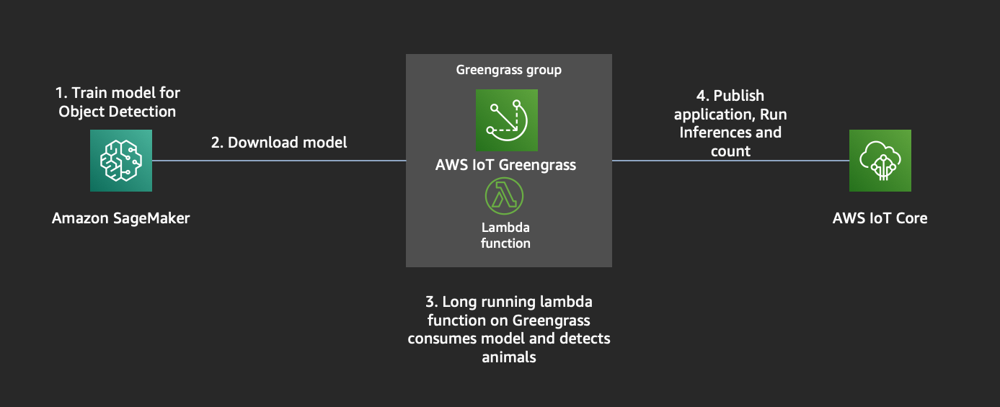
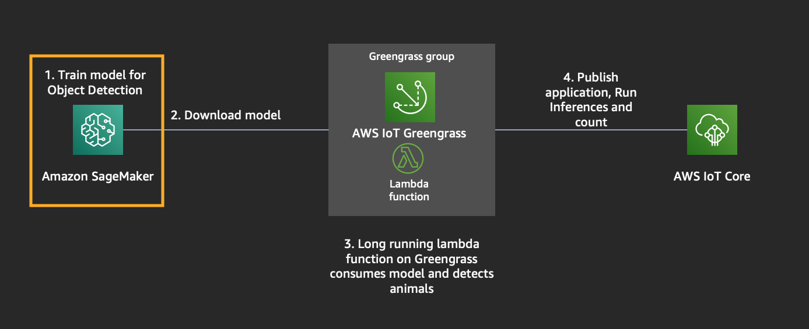
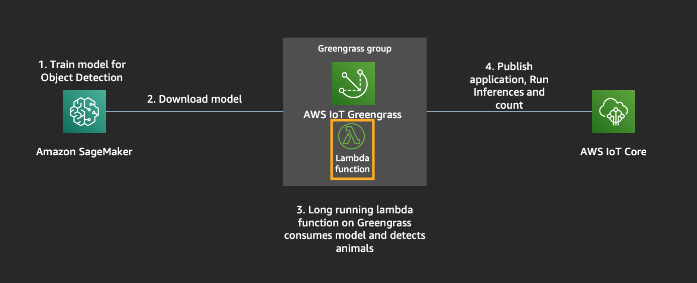
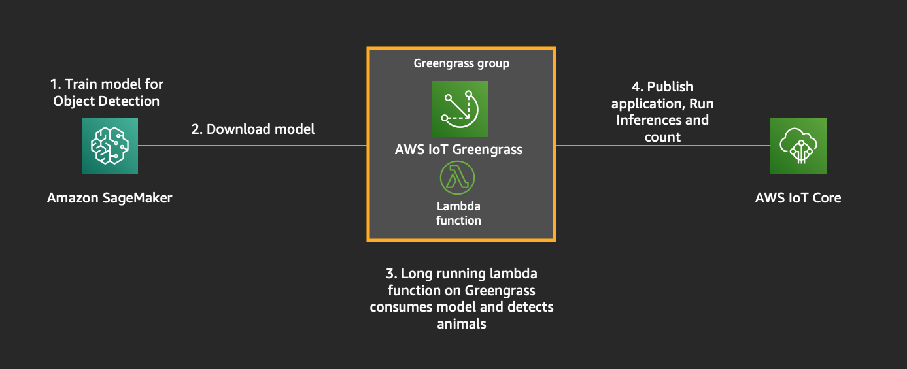
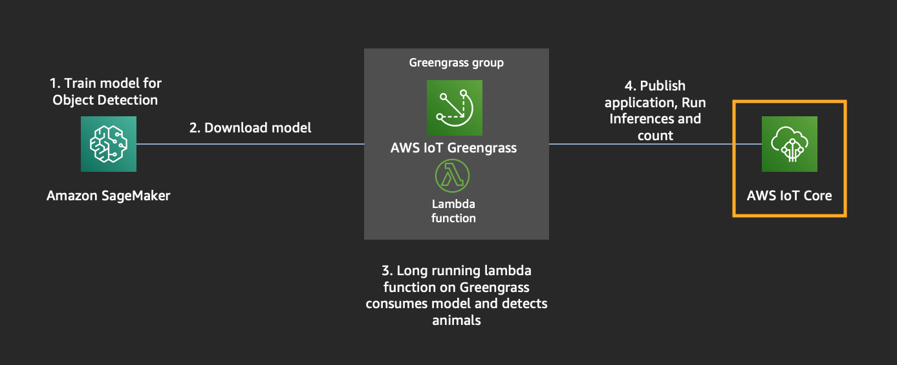
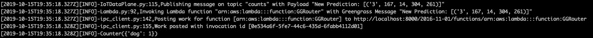

## Object Detection at the Edge

We will be building an application to detect animals at the edge. We will use an EC2 instance as our target edge device, but this device can be anything like a Raspberry Pi, NVIDIA TX2, Nano etc.  
To achieve this, we require a Machine Learning model that can detect animals and the hardware to run the application on.

## Agenda

> Module 0: Set up Infrastructure

> Module 1: Build an OD(Object Detection) Model

> Module 2: Build Lambda application

> Module 3: Set up Greengrass group, resources with lambda+ML and download certs

> Module 4: Ready to Run Inference

## Requirements

This workshop requires,

1.  AWS Account
2.  Laptop
3.  Browser

—————————————————————————————————————————————————————————————————————————————————————————————

## Module 0: Set up Infrastructure

#### SSH Key Pair Instructions

At the top right hand corner of the AWS Console, you’ll see a Support dropdown. To the left of that is the region selection dropdown. Choose US West (Oregon).

Then you’ll need to create an SSH key pair which will be used to login to the instances once provisioned. Go to the EC2 Dashboard and click on Key Pairs in the left menu under Network & Security. Click Create Key Pair, provide a name (“reinvent”) when prompted, and click Create. Once created, the private key in the form of reinvent.pem file will be automatically downloaded.

If you’re using linux or mac, change the permissions of the .pem file to be less open.

    $ chmod 400 reinvent.pem

If you’re on windows you’ll need to convert the .pem file to .ppk to work with putty. Here is a link to instructions for the file conversion - [http://docs.aws.amazon.com/AWSEC2/latest/UserGuide/putty.html](http://docs.aws.amazon.com/AWSEC2/latest/UserGuide/putty.html)

#### Context

We will be creating Infrastructure for training an Object Detection model on Sagemaker and also setting up an EC2 Instance that emulates edge device with all the required dependencies (greengrass, opencv, mxnet) to run the application.

This repository has 2 Yaml files.

*   Setting up Sagemaker Notebook instance - setup_sagemaker_notebook.yml
*   Setting up EC2 Target Instance - setup_greengrass_on_ec2.yml

1.  go to AWS Cloudformation console > Create stack (With New Resources(standard)).
2.  click on _Upload a template file_
3.  Upload setup_sagemaker_notebook.yml from your downloads
4.  Click Next
5.  Write _ReInventSagemakerNotebook_ in Name and click Next.
6.  Choose defaults and click Next.
7.  Mark the checkbox - _I acknowledge that AWS CloudFormation might create IAM resources._ and click _Create_
8.  Repeat steps 1 - 8 for _setup_greegrass_on_ec2.yml_ as well. Name the stack as _ReinventEC2Target_
    1.  For _myKeyPair_, choose _reinvent_

Wait for both cloud formation stacks to complete. Once the _ReInventSagemakerNotebook_ is complete, goto next Step

—————————————————————————————————————————————————————————————————————————————————————————————  

## Module 1: Build an Object Detection Model

Let us create an Object Detection model for identifying these 6 animals - [‘bird’, ‘cat’, ‘cow’, ‘dog’, ‘horse’, ‘sheep’]

1.  To access Sagemaker Jupyter Notebook, click on _ReInventSagemakerNotebook_ Outputs, click on _SageMakeInstance_ URL or goto Sagemaker console > Jupyter Notebooks > Open Jupyter
2.  Go to Sagemaker Examples
3.  click “use” button on “object_detection_incremental_training.ipynb”
4.  Goto Files> object_detection_pascalvoc_coco_2019-12-19 folder
5.  Upload this jupyter book from your machine - “animal_detection_recordio_format.ipynb”
6.  While we train the model, we can do other modules in parallel. Jump to Module 2.
7.  After the training completes, come back to this module and run cells until section _Hosting_. We are done with this module here.

—————————————————————————————————————————————————————————————————————————————————————————————  

## Module 2: Build Lambda application for counting

Goto AWS Lambda Console, and lets create a lambda function for detecting animals using the model and count them.

1.  Click on Create Function
2.  Author from scratch
3.  Call it _greengrassObjectDetection_
4.  Runtime: Python 2.7
5.  For the role, click _Use an existing role_ > choose that one with _ReInventEC2Target-LambdaExecution_ role
6.  Click on _create function_
7.  Now we need to upload the code inside Lambda function with our counting application. Zip the files inside greengrass-ml-lambda folder. Make sure you have installed & packaged dependencies in the requirements.txt - greengrass-ml-lambda.zip
8.  In the Lambda Console, under _Function Code_ > _Code entry type_ > Choose _upload a zip file_
9.  upload the zip file that you downloaded in step 7.
10.  Set _Handler : greengrassObjectDetection.function_handler_
11.  Let us Save and publish it.
12.  Click Save
13.  Actions
14.  Publish new version
15.  Leave Version description empty
16.  Publish
17.  Actions
18.  Create alias
19.  Name: dev
20.  Version: 1
21.  Create

Goto Module 3.  
—————————————————————————————————————————————————————————————————————————————————————————————  

## Module 3: Set up Greengrass group, resources with lambda+ML and download certs

We need to create a Greengrass group to manage devices and deploy our application, model to the device.

### Create a Greengrass group

Go to the AWS IoT Greengrass console

1.  Groups
2.  Create Group
3.  Use easy creation
4.  Group Name: greengrassReInvent
5.  Next
6.  Leave Name for Core untouched
7.  Next
8.  Create Group and Core
9.  Download these resources as a tar.gz (A tar.gz-file which contains key/certificate and configuration for Greengrass)
10.  Finish (you might need to scroll down to find this button) !!! Don’t forget to click “Finish”. Otherwise your group will not be created !!!  
    Verify in the AWS IoT console that your Greengrass Group has been created

*   Greengrass -> Groups

### Assign the ML-Inference Lambda to your Greengrass Group

##### Context

For Greengrass to use a Lambda function you need to assign the function created in AWS Lambda to your Greengrass Group.  
The Lambda function on Greengrass will be configured as a long running function because it should scan a directory for images regularly.  
Go to the AWS Greengrass console

1.  Groups
2.  Click greengrassReInvent
3.  Lambdas
4.  Add Lambda
5.  Use existing Lambda
6.  Select greengrassObjectDetection
7.  Next
8.  Select Alias: dev
9.  Finish
10.  Click … -> Edit configuration for the Lambda greengrassObjectDetection
11.  Memory limit: 1024 MB
12.  Check under Lambda lifecycle > Make this function long-lived and keep it running indefinitely
13.  Click Update

### Assign Resources to your Greengrass Group

##### Context

The object detection model which you created using SageMaker must be assigned as a machine learning resource to the Greengrass Group in order to being consumed by the Lambda function. Furthermore the directory which will be scanned for images must be assigned as a local resource.  
In the AWS Greengrass console

1.  Groups
2.  greengrassReInvent
3.  Resources
4.  Add a local resource
5.  Resource name: ImageDirectory
6.  Check Volume
7.  Source path: /greengrass-ml/images
8.  Destination path: /images
9.  Check Automatically add OS group permissions of the Linux group that owns the resource
10.  Lambda function affiliations: Select greengrassObjectDetection
11.  Check Read and write access
12.  Save
13.  Click the Machine Learning tab
14.  Add a machine learning resource
15.  Resource name: ObjectDetection
16.  If the model training is still in progress, we will wait for it to finish and then jump to the next section.

If the Sagemaker Training finishes, do this -

1.  Go back to Jupyter Notebook, run the cells that upload the deployable model to S3.
2.  In the greengrass Console, continue these steps where you left off at Step 16 previously.
3.  Choose _Upload a model in S3_ > click on Select. Goto S3 / reinventsagemakernotebook-iotwss3bucket-<xxxxxxxx> / DEMO-AnimalDetection / output / deploy / deploy_model.tar.gz
4.  Local path: /models/object-detection
5.  Lambda function affiliations: Select greengrassObjectDetection
6.  Leave Read-only access
7.  Save

—————————————————————————————————————————————————————————————————————————————————————————————  

## Module 4: Ready to Run Inference.

You downloaded the key _reinvent.pem_ in Module 0\. We will use that for this module.

Find the EC2 Instance Public IP and then do the following. IP can be found under Cloudformation > Stacks > ReInventEC2Target > Output > EC2IPAddress.

Let us first copy the downloaded certs into the target device, in this case the EC2 instance that we created

    scp -i reinvent.pem <certsID>-setup.tar.gz ubuntu@<EC2-PUBLIC-IP>:~/

Let us SSH into the machine now,

    ssh -i reinvent.pem ubuntu@<EC2-PUBLIC-IP>

extract the certs into green grass directory

    sudo tar -xvzf <certsID>-setup.tar.gz -C /greengrass

change to Root user

    sudo su -

Let us create some directories, one for storing the images.

    mkdir -p /greengrass-ml/images
    chmod 0777 /greengrass-ml/images/

Let us download amazon root cert

    cd /greengrass/certs/
    wget -O root.ca.pem https://www.amazontrust.com/repository/AmazonRootCA1.pem

[optional] check all dependencies for greengrass are installed

    cd ~

    wget https://github.com/aws-samples/aws-greengrass-samples/raw/master/greengrass-dependency-checker-GGCv1.10.x.zip
    unzip greengrass-dependency-checker-GGCv1.10.x.zip
    cd greengrass-dependency-checker-GGCv1.10.x/
    ./check_ggc_dependencies | more

Start the greengrass core now

    cd /greengrass/ggc/core
    ./greengrassd start
    ps aux | grep greengrass

Tail the logs

    tail -f /greengrass/ggc/var/log/system/runtime.log

Goto Greengrass Console > your group > Actions > deploy > Automatic Detection.

    tail -f /greengrass/ggc/var/log/system/runtime.log
    tail -f /greengrass/ggc/var/log/user/us-west-2/<accountID>/greengrassObjectDetectionReinvent.log

You will see some ERRORs in the logs because we have not copied any images for inference yet.

Test for inference  
Example 1:

    wget -O /greengrass-ml/images/sample.jpeg << DOWNLOAD AN IMAGE YOU WANT >>
    tail -f /greengrass/ggc/var/log/user/us-west-2/<accountID>/greengrassObjectDetectionReinvent.log

you should see a similar output like this -  

Example 2:

    wget -O /greengrass-ml/images/sample.jpeg << DOWNLOAD AN IMAGE YOU WANT >>
    tail -f /greengrass/ggc/var/log/user/us-west-2/<accountID>/greengrassObjectDetectionReinvent.log

### Troubleshooting

If you see an error like this,  
`[2019-10-29T19:52:45.945Z][ERROR]-runtime execution error: unable to start lambda container. {"errorString": "failed to run container sandbox: container_linux.go:344: starting container process caused \"exec: \\\"python2.7\\\": executable file not found in $PATH\""} [2019-10-29T19:52:45.946Z][ERROR]-Failed to start worker. {"workerId": "1c2f57d6-2ea1-4080-73bd-d475b9c9cf6a", "functionArn": "arn:aws:lambda:us-west-2:523344958585:function:ggObjectDetection:1", "errorString": "process start failed: failed to run container sandbox: container_linux.go:344: starting container process caused \"exec: \\\"python2.7\\\": executable file not found in $PATH\""}`  
Lets install these packages -

    sudo su -
    apt install python2.7
    apt install python-pip
    pip install mxnet
    pip install opencv-python

—————————————————————————————————————————————————————————————————————————————————————————————

## [Optional] Module 5: Subscribe to IoT Topic for Notifications.

1.  Goto Greengrass > Groups > greengrassReInvent
2.  Subscriptions
3.  Add your first subscription
4.  Select a source : Lambdas > greengrassObjectDetection
5.  Select a target : Services > IoT Cloud
6.  Next
7.  Topic filter : counts
8.  Finish
9.  Actions > Deploy

Once the deployment is complete,

1.  Goto Greengrass > Test > Subscribe to a topic
2.  Subscription topic : counts
3.  Subscribe to topic
4.  You should start seeing your messages now.
## License

This asset is licensed under the MIT-0 License. See the LICENSE file.

